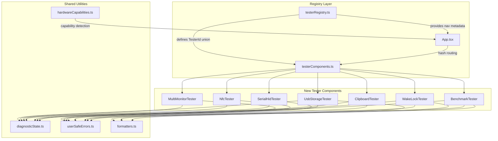

# Design Document: New Hardware Testers

## Overview

This design adds seven new hardware diagnostic testers to the existing Hardware Diagnostic Suite: USB/Storage, Multi-Monitor, NFC, Serial/HID, Clipboard, Wake Lock, and Performance Benchmark. Each tester follows the established component architecture — a standalone React component registered in the tester registry, mapped in the component map, and rendered via hash-based routing.

All testers share a common pattern: detect API availability on mount, display an unsupported state when the API is missing, handle permissions gracefully, and map errors through the existing `userSafeErrors` utility. No backend dependencies are introduced; all diagnostics run client-side using browser APIs.

### Key Design Decisions

1. **Reuse existing infrastructure** — tester registry, component map, diagnosticState, userSafeErrors, formatters, and CSS custom properties are all leveraged without modification to their interfaces.
2. **Progressive enhancement** — each tester renders useful information even when only partial API support exists (e.g., Serial/HID tester enables whichever sub-API is available).
3. **Non-blocking execution** — the Performance Benchmark uses chunked execution via `requestAnimationFrame` / `setTimeout` to avoid blocking the main thread beyond 50ms.
4. **Privacy-first** — no data leaves the browser. NFC tag data, clipboard contents, and benchmark results are held in component state only.

## Architecture



### Routing Integration

Each new tester gets a unique `TesterId` string added to the union type. The hash-based router in `App.tsx` already handles any valid `TesterId` — no routing changes are needed beyond extending the type and registry array.

### Group Assignments

| Tester | ID | Group | Rationale |
|--------|-----|-------|-----------|
| USB/Storage | `usb-storage` | `system` | Storage is a system resource |
| Multi-Monitor | `multi-monitor` | `media` | Display output category |
| NFC | `nfc` | `advanced` | Specialized hardware, limited browser support |
| Serial/HID | `serial-hid` | `advanced` | Low-level device access |
| Clipboard | `clipboard` | `tools` | Utility/diagnostic tool |
| Wake Lock | `wake-lock` | `system` | System power management |
| Benchmark | `benchmark` | `system` | CPU/memory system metrics |

## Components and Interfaces

### Registry Extensions

```typescript
// Added to TesterId union
| 'usb-storage'
| 'multi-monitor'
| 'nfc'
| 'serial-hid'
| 'clipboard'
| 'wake-lock'
| 'benchmark'

// Added to testers array
{ id: 'usb-storage', label: 'USB/Storage', group: 'system', dashboardDescription: 'Storage quota and usage info' }
{ id: 'multi-monitor', label: 'Multi-Monitor', group: 'media', dashboardDescription: 'Detect and map connected displays' }
{ id: 'nfc', label: 'NFC', group: 'advanced', dashboardDescription: 'Read NFC tags and NDEF records' }
{ id: 'serial-hid', label: 'Serial/HID', group: 'advanced', dashboardDescription: 'Raw device communication' }
{ id: 'clipboard', label: 'Clipboard', group: 'tools', dashboardDescription: 'Test clipboard read and write' }
{ id: 'wake-lock', label: 'Wake Lock', group: 'system', dashboardDescription: 'Prevent screen dimming' }
{ id: 'benchmark', label: 'Benchmark', group: 'system', dashboardDescription: 'CPU and memory performance test' }
```

### Component Interfaces

Each component is a default-exported React functional component with no props (consistent with existing testers):

```typescript
// src/components/UsbStorageTester.tsx
export default function UsbStorageTester(): JSX.Element

// src/components/MultiMonitorTester.tsx
export default function MultiMonitorTester(): JSX.Element

// src/components/NfcTester.tsx
export default function NfcTester(): JSX.Element

// src/components/SerialHidTester.tsx
export default function SerialHidTester(): JSX.Element

// src/components/ClipboardTester.tsx
export default function ClipboardTester(): JSX.Element

// src/components/WakeLockTester.tsx
export default function WakeLockTester(): JSX.Element

// src/components/BenchmarkTester.tsx
export default function BenchmarkTester(): JSX.Element
```

### Shared Internal Patterns

Each tester follows this internal structure:

```typescript
function SomeTester() {
    const [isSupported, setIsSupported] = useState<boolean>(/* API check */);
    const [status, setStatus] = useState<DiagnosticState>(readyDiagnosticState());
    // ... tester-specific state

    // Cleanup on unmount
    useEffect(() => { return () => { /* release resources */ }; }, []);

    return (
        <section aria-labelledby="tester-title">
            <header className="tester-panel__header">
                <h2 id="tester-title">Tester Name</h2>
                <p>Description text.</p>
            </header>
            <div className="tester-panel__body">
                {!isSupported ? <UnsupportedMessage /> : <TesterContent />}
            </div>
        </section>
    );
}
```

### Utility Functions (new)

```typescript
// src/lib/formatters.ts — additions
export function formatHhMmSs(totalSeconds: number): string;
export function formatOpsPerSecond(operations: number, durationMs: number): string;
export function formatMbPerSecond(bytes: number, durationMs: number): string;

// src/lib/benchmarkRunner.ts — new file
export interface BenchmarkResult {
    type: 'cpu' | 'memory';
    value: number;        // ops/sec or MB/s
    timestamp: number;
    durationMs: number;
}

export function runCpuBenchmark(
    onProgress: (pct: number) => void,
    signal: AbortSignal
): Promise<BenchmarkResult>;

export function runMemoryBenchmark(
    onProgress: (pct: number) => void,
    signal: AbortSignal
): Promise<BenchmarkResult>;

// src/lib/hexFormat.ts — new file
export function formatBytesAsHex(data: ArrayBuffer | Uint8Array): string;
export function formatLogEntry(data: Uint8Array, reportId?: number): { hex: string; timestamp: string };
```

### Hardware Capabilities Extensions

New entries added to `hardwareCapabilities` array in `src/lib/hardwareCapabilities.ts`:

```typescript
{ id: 'storage-api', label: 'Storage API', testerId: 'usb-storage', platform: 'all', ... }
{ id: 'window-management', label: 'Window Management', testerId: 'multi-monitor', platform: 'desktop', ... }
{ id: 'web-nfc', label: 'Web NFC', testerId: 'nfc', platform: 'mobile', ... }
{ id: 'web-hid', label: 'WebHID', testerId: 'serial-hid', platform: 'desktop', ... }
{ id: 'clipboard', label: 'Clipboard', testerId: 'clipboard', platform: 'all', ... }
{ id: 'wake-lock', label: 'Wake Lock', testerId: 'wake-lock', platform: 'all', ... }
{ id: 'perf-timing', label: 'High-res timing', testerId: 'benchmark', platform: 'all', ... }
```

## Data Models

### USB/Storage Tester

```typescript
interface StorageEstimate {
    quota: number;   // bytes
    usage: number;   // bytes
}

interface StorageDisplayState {
    quota: string;       // formatted (e.g., "4.2 GB")
    usage: string;       // formatted
    percentage: number;  // 0–100, integer
    loading: boolean;
    error: string | null;
}
```

### Multi-Monitor Tester

```typescript
interface ScreenInfo {
    label: string;
    width: number;
    height: number;
    left: number;
    top: number;
    devicePixelRatio: number;
    isPrimary: boolean;
}

interface MonitorDisplayState {
    screens: ScreenInfo[];
    loading: boolean;
    error: string | null;
}
```

### NFC Tester

```typescript
type NfcScanStatus = 'idle' | 'active' | 'detected';

interface NdefRecordInfo {
    recordType: string;  // TNF + type field
    payload: string;     // UTF-8 decoded
}

interface NfcTagInfo {
    serialNumber: string;
    records: NdefRecordInfo[];
}

interface NfcDisplayState {
    scanStatus: NfcScanStatus;
    tag: NfcTagInfo | null;
    error: string | null;
}
```

### Serial/HID Tester

```typescript
interface LogEntry {
    timestamp: string;
    hex: string;
    reportId?: number;
}

interface HidDeviceInfo {
    productName: string;
    vendorId: number;
    productId: number;
    collections: { usagePage: number; usage: number }[];
}

interface SerialHidState {
    hidSupported: boolean;
    serialSupported: boolean;
    hidDevice: HidDeviceInfo | null;
    hidConnected: boolean;
    hidLog: LogEntry[];
    serialConnected: boolean;
    serialLog: LogEntry[];
    baudRate: number;
    error: string | null;
}
```

### Clipboard Tester

```typescript
type PermissionState = 'granted' | 'denied' | 'prompt';

interface ClipboardDisplayState {
    readPermission: PermissionState;
    writePermission: PermissionState;
    clipboardContent: string | null;
    lastWriteStatus: string | null;
    error: string | null;
}
```

### Wake Lock Tester

```typescript
type WakeLockStatus = 'inactive' | 'active' | 'released';

interface WakeLockDisplayState {
    status: WakeLockStatus;
    elapsedSeconds: number;
    releaseReason: string | null;
    canReacquire: boolean;
    error: string | null;
}
```

### Performance Benchmark Tester

```typescript
interface BenchmarkResult {
    type: 'cpu' | 'memory';
    value: number;
    timestamp: number;
    durationMs: number;
}

interface BenchmarkDisplayState {
    running: boolean;
    progress: number;          // 0–100
    history: BenchmarkResult[]; // max 10, newest first
    hardwareConcurrency: number;
    deviceMemory: number | null;
    error: string | null;
}
```

## Correctness Properties

*A property is a characteristic or behavior that should hold true across all valid executions of a system — essentially, a formal statement about what the system should do. Properties serve as the bridge between human-readable specifications and machine-verifiable correctness guarantees.*

### Property 1: Storage percentage calculation

*For any* storage quota > 0 and any usage value ≥ 0, the computed percentage SHALL equal `Math.round((usage / quota) * 100)` clamped to the range [0, 100], and for quota === 0 the result SHALL be 0.

**Validates: Requirements 1.4, 1.5**

### Property 2: Multi-monitor screen data completeness

*For any* array of screen objects returned by the Window Management API, the rendered output SHALL contain the resolution (width × height), position (left, top), device pixel ratio, and label for every screen in the array, and exactly one screen SHALL be marked with the "Primary" label.

**Validates: Requirements 2.1, 2.4**

### Property 3: Screen layout diagram proportional positioning

*For any* set of screen objects with left/top offsets and width/height values, the rendered layout rectangles SHALL be positioned such that the relative distances between rectangles are proportional to the relative distances between the reported offsets, and each rectangle's aspect ratio matches its screen's width:height ratio.

**Validates: Requirements 2.6**

### Property 4: NFC tag data display completeness

*For any* NFC tag with a serial number and N NDEF records (N ≥ 0), the rendered output SHALL contain the serial number, and for each record SHALL display the record type and UTF-8 decoded payload. When N = 0, a "no NDEF data" message SHALL be displayed instead of records.

**Validates: Requirements 3.1, 3.2**

### Property 5: NFC scan status state exclusivity

*For any* sequence of scan lifecycle events (start, tag-detected, stop, error), the scan status SHALL always be exactly one of: idle, active, or detected — never more than one simultaneously and never an undefined state.

**Validates: Requirements 3.7**

### Property 6: Device log hex formatting and entry cap

*For any* byte array of length L, the formatted hex string SHALL contain exactly L space-separated two-character uppercase hexadecimal values. *For any* log with more than 200 entries appended, the retained log SHALL contain exactly 200 entries (the most recent 200).

**Validates: Requirements 4.2, 4.4**

### Property 7: Clipboard permission state display

*For any* combination of clipboard-read and clipboard-write permission states (each being one of granted, denied, or prompt), the rendered output SHALL display both permission names with their corresponding state values.

**Validates: Requirements 5.5**

### Property 8: Duration timer HH:MM:SS formatting

*For any* non-negative integer representing elapsed seconds, the formatted duration string SHALL match the pattern `HH:MM:SS` where HH = Math.floor(seconds / 3600) zero-padded to 2 digits, MM = Math.floor((seconds % 3600) / 60) zero-padded to 2 digits, SS = (seconds % 60) zero-padded to 2 digits.

**Validates: Requirements 6.7**

### Property 9: Benchmark result calculation

*For any* positive operation count and positive duration in milliseconds, the CPU ops/sec result SHALL equal `operations / (durationMs / 1000)`, and for any positive byte count and positive duration, the memory MB/s result SHALL equal `bytes / (durationMs / 1000) / 1_000_000`.

**Validates: Requirements 7.1, 7.2**

### Property 10: Benchmark progress percentage

*For any* elapsed time value where 0 ≤ elapsed ≤ totalDuration, the progress percentage SHALL equal `Math.round((elapsed / totalDuration) * 100)` and SHALL be in the range [0, 100].

**Validates: Requirements 7.3**

### Property 11: Benchmark history ordering and cap

*For any* sequence of N benchmark results where N > 10, the displayed history SHALL contain exactly 10 entries ordered from newest (index 0) to oldest (index 9), and each entry's timestamp SHALL be ≥ the timestamp of the entry after it.

**Validates: Requirements 7.6**

### Property 12: Error sanitization through userSafeErrors

*For any* DOMException or Error instance passed through `getUserSafeError`, the returned message SHALL NOT contain the original exception's `name`, `stack`, or raw `message` properties when those differ from the mapped user-safe message. The output SHALL always contain a `stableCode`, a user-facing `message`, and a `detail` string.

**Validates: Requirements 3.5, 8.6, 8.8**

### Property 13: Graceful degradation for unsupported APIs

*For any* new tester component rendered in an environment where its required browser API is undefined, the component SHALL render without throwing an uncaught exception, SHALL display a status message identifying the unsupported feature, and SHALL have all API-dependent interactive controls disabled.

**Validates: Requirements 8.3**

## Error Handling

### Error Flow

All testers follow the same error handling pipeline:

```
Browser API throws → catch block → getUserSafeError(error) → setStatus(errorDiagnosticState(msg)) → render inline
```

### Error Categories

| Error Type | Source | Handling |
|-----------|--------|----------|
| API Unavailable | Feature detection on mount | Set `isSupported = false`, render Unsupported_State |
| Permission Denied | `NotAllowedError` DOMException | Map through `userSafeErrors`, show permission hint |
| Device Not Found | `NotFoundError` DOMException | Map through `userSafeErrors`, show reconnect hint |
| Device Busy | `NotReadableError` DOMException | Map through `userSafeErrors`, show close-other-apps hint |
| Operation Aborted | `AbortError` DOMException | Silently ignore (user-initiated cancel) |
| Network/Timeout | Fetch failures | Map through `userSafeErrors`, show retry hint |
| Unknown | Any other error | Map to `UNKNOWN_BROWSER_ERROR`, show generic retry message |

### Resource Cleanup

Each tester releases resources on unmount:
- **NFC**: Abort the NDEFReader scan via AbortController
- **Serial/HID**: Close open ports and device handles
- **Wake Lock**: Release the WakeLockSentinel
- **Benchmark**: Abort via AbortController, cancel pending rAF/setTimeout

### Unsupported State Pattern

```typescript
if (!isSupported) {
    return (
        <div className="status-display" style={{ color: 'var(--error)' }}>
            {apiName} is not available in this browser.
            {chromiumHint && <p>Try Chrome or Edge on {platform}.</p>}
        </div>
    );
}
```

## Testing Strategy

### Unit Tests (Vitest)

Unit tests cover specific examples, edge cases, and integration points:

- **Registry smoke tests**: Verify all 7 new tester IDs exist in the registry with required fields
- **Component map smoke tests**: Verify all 7 IDs map to a component
- **Unsupported state rendering**: Each tester renders gracefully when its API is mocked as undefined
- **Permission denial handling**: Each permission-gated tester shows the correct message
- **formatHhMmSs edge cases**: 0 seconds, exactly 1 hour, large values
- **formatBytesAsHex edge cases**: Empty array, single byte, 255 values
- **Benchmark runner**: Verify chunked execution doesn't block > 50ms (mock timing)

### Property-Based Tests (Vitest + fast-check)

Property-based tests verify universal correctness properties across generated inputs. The project will use `fast-check` as the PBT library integrated with Vitest.

**Configuration:**
- Minimum 100 iterations per property test
- Each test tagged with: `Feature: new-hardware-testers, Property {N}: {title}`

**Properties to implement:**

1. **Storage percentage calculation** — Generate random quota/usage pairs, verify percentage formula
2. **Screen data completeness** — Generate random screen arrays, verify all fields rendered
3. **Layout diagram positioning** — Generate screen configs, verify proportional positioning
4. **NFC tag display** — Generate random tag data, verify completeness
5. **NFC status exclusivity** — Generate event sequences, verify single active state
6. **Hex formatting and log cap** — Generate byte arrays and log sequences, verify format and cap
7. **Clipboard permission display** — Generate permission state combinations, verify rendering
8. **HH:MM:SS formatting** — Generate seconds values, verify format pattern
9. **Benchmark calculation** — Generate operation/duration pairs, verify arithmetic
10. **Progress percentage** — Generate elapsed/total pairs, verify range and formula
11. **History ordering and cap** — Generate result sequences, verify ordering and max 10
12. **Error sanitization** — Generate error types, verify no raw details leak
13. **Graceful degradation** — For each tester, mock API unavailable, verify no exceptions

### E2E Tests (Playwright)

- Navigation to each new tester via hash URL
- Unsupported state rendering in browsers lacking the API
- Basic interaction flows where APIs can be mocked (clipboard, wake lock)

### Test File Structure

```
src/lib/__tests__/
  formatters.test.ts          (extend with new formatter tests)
  hexFormat.test.ts           (new)
  benchmarkRunner.test.ts     (new)
  hardwareCapabilities.test.ts (extend with new capabilities)

src/lib/__tests__/properties/
  storagePercentage.prop.test.ts
  screenData.prop.test.ts
  layoutDiagram.prop.test.ts
  nfcTagDisplay.prop.test.ts
  nfcStatus.prop.test.ts
  hexFormatAndCap.prop.test.ts
  clipboardPermission.prop.test.ts
  durationFormat.prop.test.ts
  benchmarkCalc.prop.test.ts
  progressPercentage.prop.test.ts
  historyOrdering.prop.test.ts
  errorSanitization.prop.test.ts
  gracefulDegradation.prop.test.ts
```
